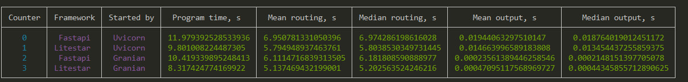

### Launch
- Download python (preferably v3.13)
- Creating a virtual environment 
- Activate the venv
- pip install -r requirements.txt
- Use granian, uvicorn or some else to start one at a timesrc.suits.test_fastapi.main:app and
src.suits.test_litestar.main:app. I tested with these commands:
- - python -m uvicorn src.suits.test_fastapi.main:app --log-level critical
- - python -m uvicorn src.suits.test_litestar.main:app --log-level critical
- - python -m granian  --interface asgi src.suits.test_fastapi.main:app
- - python -m granian  --interface asgi src.suits.test_litestar.main:app
- Start testing file: python -m src.suits.testing

My results:

